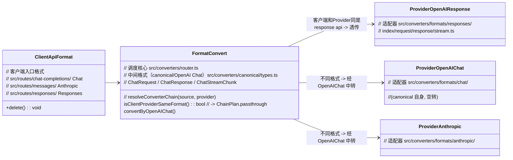

# 支持 OpenAI response api

## 设计思路

所有格式先归一为中间格式（OpenAI Chat），再发射到目标 provider。客户端与 provider 同格式时透传，不转换。

## 核心流程

每个请求按客户端入口格式经 `resolveConverterChain` 出适配器：

1. `resolveConverterChain(clientFormat, providerFormat)` 生成 `ChainPlan`。
2. `plan.passthrough` 为真（归一化后同格式，如 responses→response-api）→ **透传**，仅替换 `model`。
3. 否则两段转换：`sourceAdapter.toChatRequest(req)` 归一到 canonical，再 `providerAdapter.fromChatRequest(chat)` 发射到上游格式。流式同理，串接上下游 `StreamConverter`。

> 例外（老逻辑，本次不改）：`routes/chat-completions/` 与 `routes/messages/` 入口已用 `resolveConverterChain` 判定 passthrough，但需要转换时仍**直接调用硬编码转换函数**（如 `convertOpenAIRequestToAnthropic`），未走通用 adapter 链，功能等价。

## 管理端配置

`response-api` provider 已暴露到 admin 模型表单（`src/admin/routes/model-form.tsx` + `views/model-form.tsx`），测试连接按 Responses 协议发 `/v1/responses`（`input`/`max_output_tokens`/`output` 解析）。
